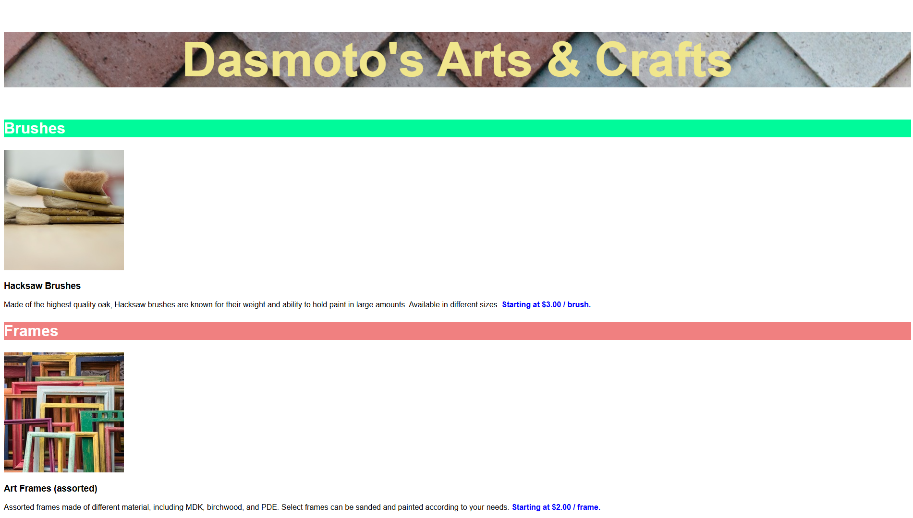

# Dasmoto's Arts & Crafts 🎨

A responsive static website for a fictional arts and crafts store, built with pure HTML and CSS. Created as part of Codecademy's "Full-Stack Engineer" path to practice foundational web development skills.



## 🚀 Live Demo
[View on GitHub Pages](https://yvett-codes.github.io/dasmoto-arts-crafts/)  

## 🛠️ Tech Stack
- **HTML5** (semantic structure)
- **CSS3** (external stylesheet)
- **Git** (version control)

## 📂 Project Structure
```bash
.
├── index.html
├── styles.css
├── assets/
│   ├── pattern.jpeg
│   ├── hacksaw.jpeg
│   ├── frames.jpeg
│   └── finnish.jpeg
└── README.md
```